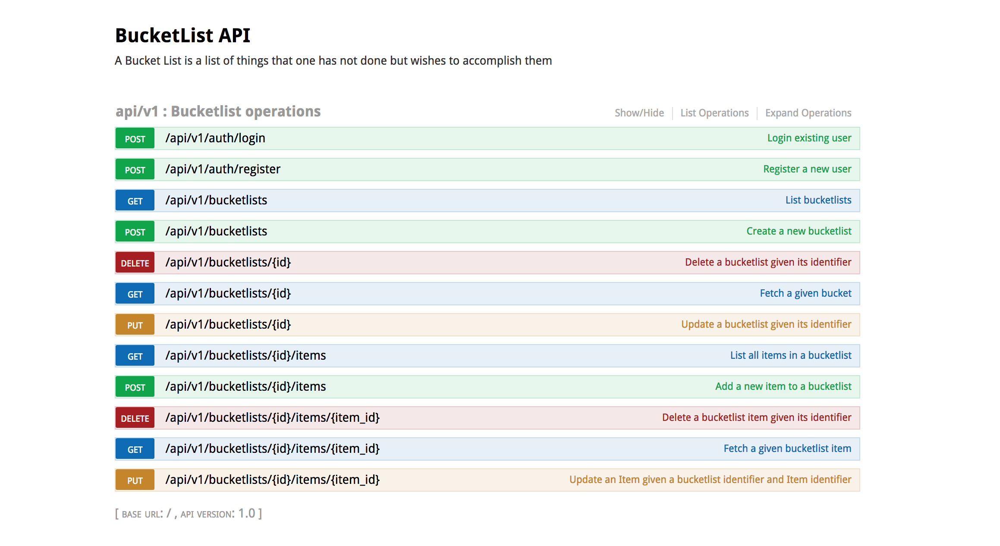
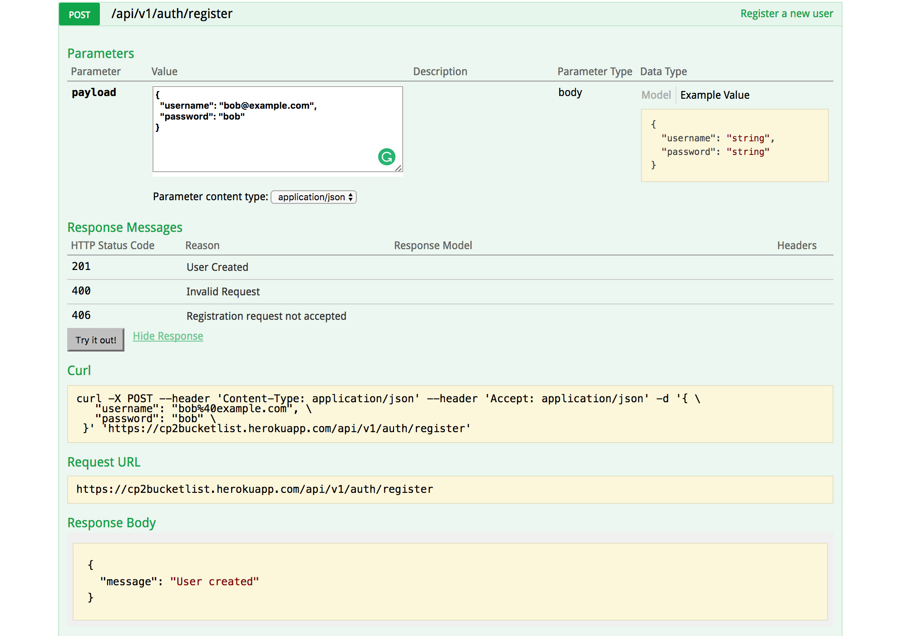
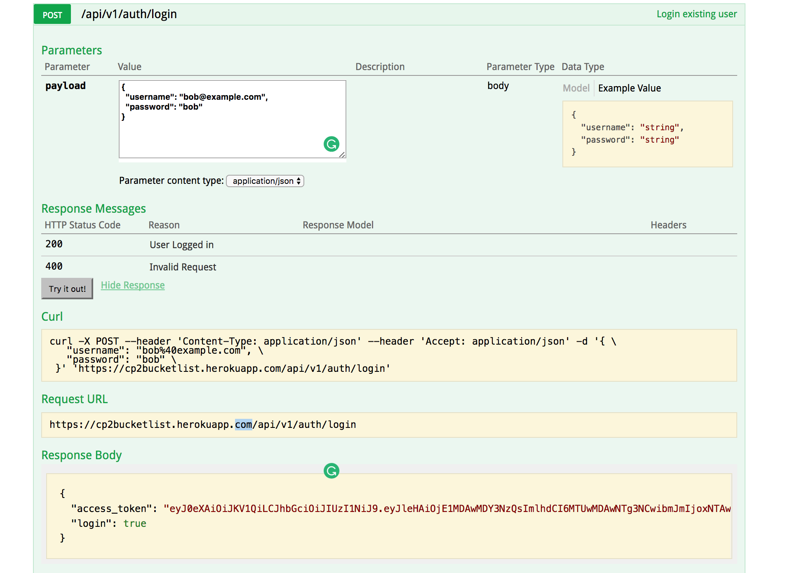
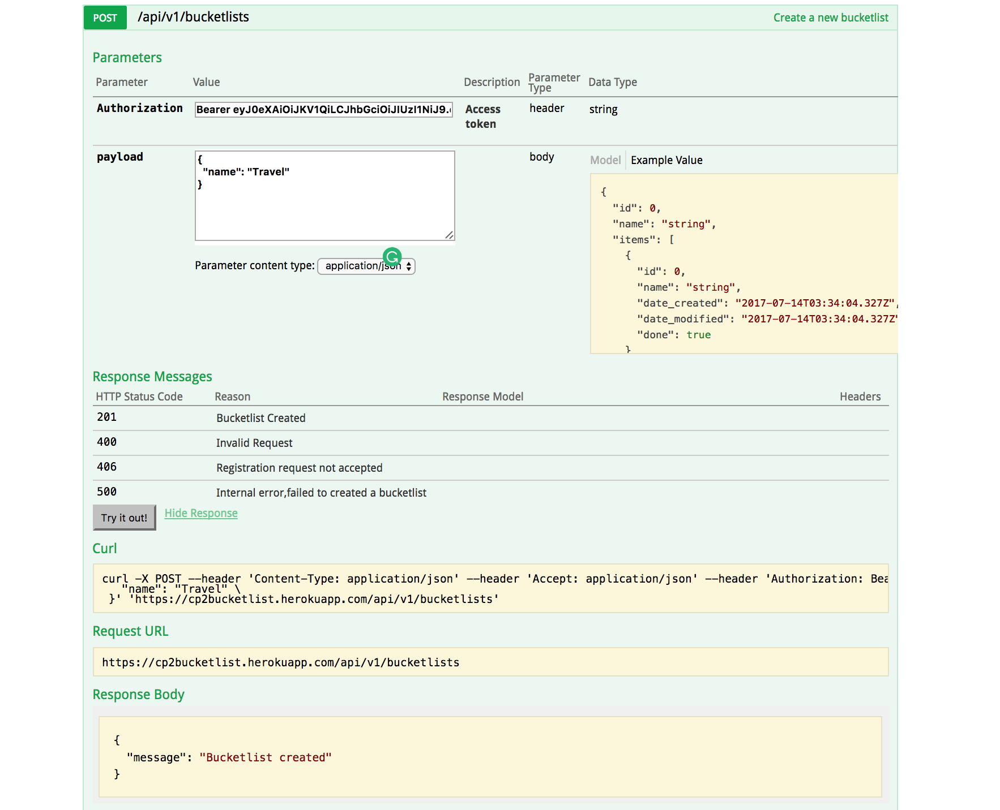
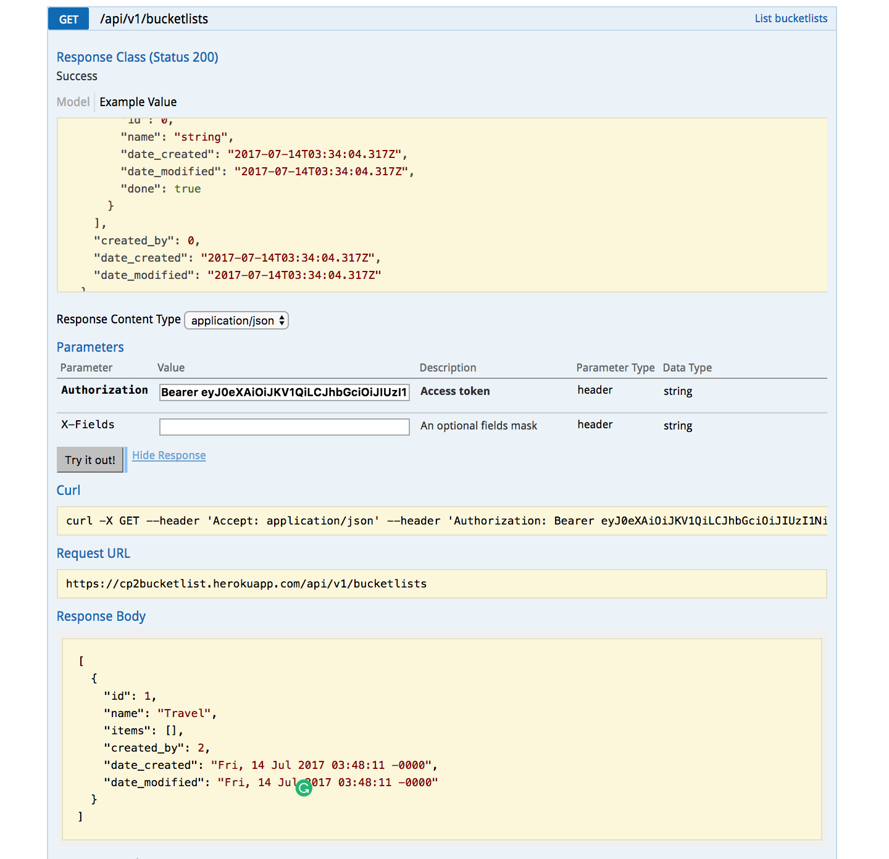
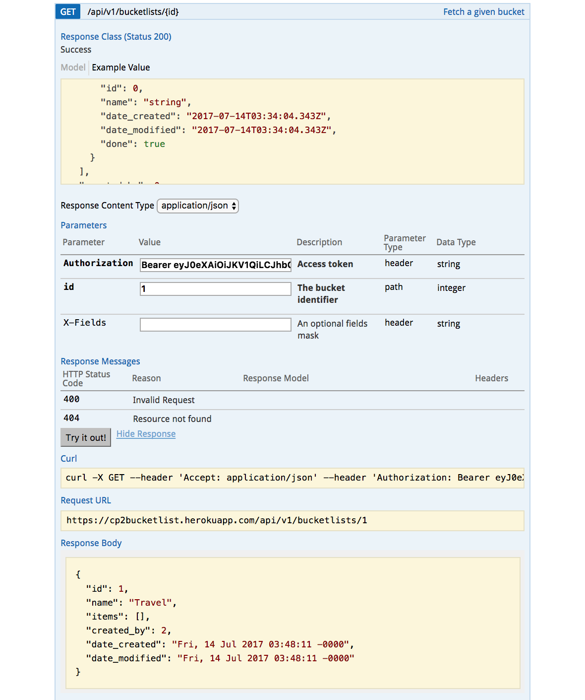
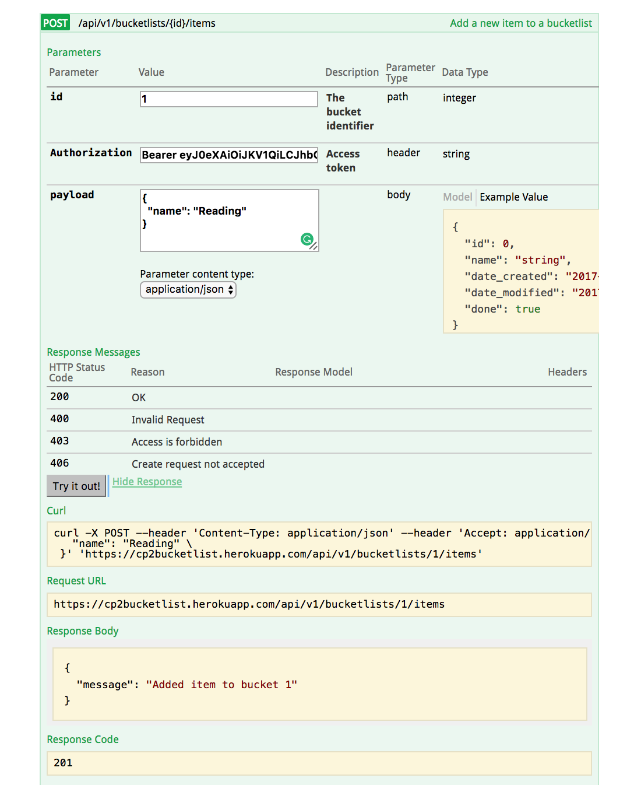
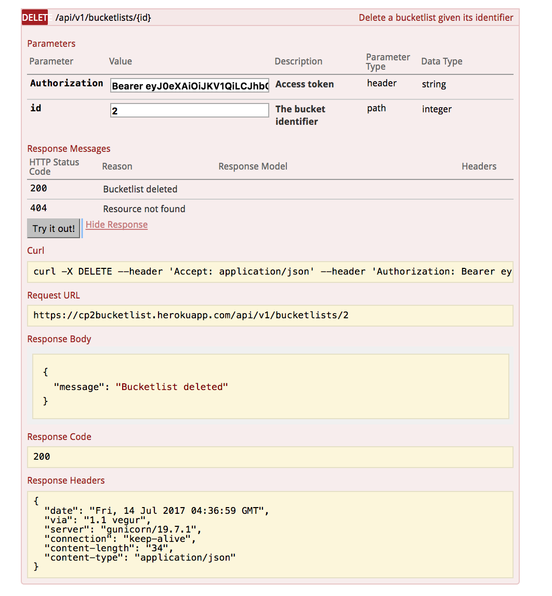

# Bucketlist API
 
## Introduction
A Bucket List is a list of things that one has not done but wishes to accomplish within a certain time span. 

>The API is hosted live on Heroku; https://cp2bucketlist.herokuapp.com/

>Accessing the above URL will point you to an interactive documentation page from which you can access all the endpoints of this API.

# Project description
This API has been designed to enables CRUD functionality (Create, Read, Update, Delete) operations on the bucket list. It allows users to register and manage their bucketlists.

## Requirements

## Installation
 
Clone the GitHub repo:
 
http:
>`$ git clone https://github.com/wikedzit/bucketlist.git`

cd into the folder and install a [virtual environment](https://virtualenv.pypa.io/en/stable/)

Install all app requirements

`$ pip install -r requirements.txt`
Create the database and run migrations

`$ python manage.py databases init`

`$ python manage.py databases migrate`

`$ python manage.py databases upgrade`

### Endpoints

Here is a list of all the endpoints in bucketlist app.

Endpoint | Functionality| Access
------------ | ------------- | ------------- 
POST bucketlist/app/v1/auth/login |Logs a user in | PUBLIC
POST bucketlist/app/v1/auth/register | Registers a user | PUBLIC
POST bucketlist/app/v1/bucketlists/ | Creates a new bucket list | PRIVATE
GET bucketlist/app/v1/bucketlists/ | Lists all created bucket lists | PRIVATE
GET bucketlist/app/v1/bucketlists/id | Gets a single bucket list with the suppled id | PRIVATE
PUT bucketlist/app/v1/bucketlists/id | Updates bucket list with the suppled id | PRIVATE
DELETE bucketlist/app/v1/bucketlists/id | Deletes bucket list with the suppled id | PRIVATE
POST bucketlist/app/v1/bucketlists/id/items/ | Creates a new item in bucket list | PRIVATE
PUT bucketlist/app/v1/bucketlists/id/items/item_id | Updates a bucket list item | PRIVATE
DELETE bucketlist/app/v1/bucketlists/id/items/item_id | Deletes an item in a bucket list | PRIVATE

### Screenshots
>API Documentation

>Register

>Login

>add bucket

>list all buckets

>get single bucket

>add item

>delete a bucket

### Testing
Tests have been implemented using unittest framework
Run the tests using nose, run `nosetests`

## Credits

1. [Timothy Wikedzi](https://github.com/wikedzit)
